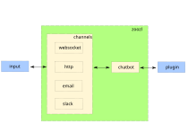

# zoozl

Server for chatbot services

## Usage

For basic example a chatbot plugin is provided in `zoozl.plugins` package. It is a simple chatbot that allows to play bulls & cows game. It is also a plugin that is loaded in case no configuration file is provided.

### Run websocket server

```bash
python -m zoozl --conf chatbot.toml
```
where `chatbot.toml` is configuration file.

## Architecture

zoozl package contains modules that handle various input interfaces like websocket or http POST and a chatbot interface that must be extended by a single agent. Without an agent zoozl is not able to respond to any input. The agent can be huge and complex or simple and small. It is up to the developer to decide how to compose behaviour.



## Plugin

### Mimimal setup

1. Create new toml configuration file (e.g. myconfig.toml)
```
agent = "my_plugin_module"
```
2. Make sure `my_plugin_module` is importable from within python that will run zoozl server
3. Create file `my_plugin_module.py`
```
from zoozl.chatbot import Agent

class Agent(Agent):

    async def consume(self, package):
        package.callback("Hello this is my plugin response")
```
4. Start zoozl server with your configuration file and ask the bot anything, it will respond `Hello this is my plugin response`
```bash
python -m zoozl --conf myconfig.toml
```

### Plugin interface

Agent must implement `consume(package)`. `package` contains input message and callback method to send response back to the user. Optional methods are `load(root)` and `greet(package)`.

zoozl core does not route between multiple plugins. If you need multiple behaviours, compose them inside your agent using `conversation.data`.

### Configuration file

Configuration file must conform to TOML format. Example of configuration:
```
agent = "chatbot_fifa_extension"
websocket_port = 80  # if not provided, server will not listen to websocket requests
author = "my_chatbot_name"  # defaults to empty string
slack_port = 8080  # if not provided, server will not listen to slack requests
slack_app_token = "xoxb-12333" # Mandatory if slack_port is provided, oAuth token for slack app to send requests to slack
slack_signing_secret = "abc123" # Mandatory if slack_port is provided, secret key to verify requests from slack
email_port = 8081  # if provided, server will listen to LMTP requests there
email_address = "something@localhost"  # Mandatory if email_port is provided, email address to send back email messages to
email_smtp_port = 25  # Optional port for sending out email messages to, defaults to 25
whatsapp_port = 8082  # if provided, server will listen to WhatsApp Cloud API webhook requests there
whatsapp_verify_token = "my_verify_token"  # Mandatory if whatsapp_port is provided, token for webhook verification
whatsapp_access_token = "EAAG..."  # Mandatory if whatsapp_port is provided, Meta Graph API access token
whatsapp_phone_number_id = "123456789"  # Mandatory if whatsapp_port is provided, WhatsApp phone number ID
whatsapp_app_secret = "abc123"  # Optional, app secret for verifying X-Hub-Signature-256 on inbound requests

[chatbot_fifa_extension]  # would be considered as specific configuration for plugin
database_path = "tests/tmp"
administrator = "admin"
```

Root objects like author and agent are configuration options for chatbot system wide setup.


* TODO: Describe plugin interface and creation
* TODO: Add authentication and authorization interaction between chatbot and plugin
